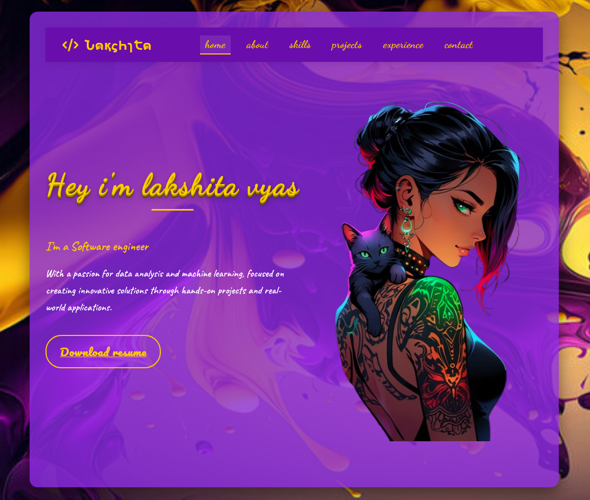

# Lakshita Vyas - Personal Portfolio

A modern, interactive portfolio website showcasing my skills, projects, and professional experience as a software developer and data analyst.



## 🌟 Features

- **Interactive UI**: Smooth scrolling, animations, and responsive design
- **Theme Switching**: Choose between light, dark, and purple themes
- **Project Showcase**: Highlighting key projects with GitHub links
- **Skills Section**: Visual representation of technical skills
- **Contact Form**: Integrated with Formspree for email functionality
- **AI Chatbot**: Integrated with Chatbase for visitor interaction
- **Responsive Design**: Optimized for all device sizes

## 💻 Technologies Used

- HTML5
- CSS3 (Custom animations and responsive design)
- JavaScript (ES6+)
- Font Awesome for icons
- Google Fonts
- Formspree for contact form
- Chatbase for AI chatbot integration

## 🚀 Setup and Deployment

1. Clone the repository
   ```
   git clone https://github.com/lakshitavyas02/Portfolio.git
   ```

2. Open `index.html` in your browser to view locally

3. To deploy:
   - Host on GitHub Pages
   - Or deploy to any web hosting service

## 📝 Contact Form Setup

The contact form is powered by Formspree:

1. The form is already configured with a Formspree endpoint
2. Form submissions will be sent to the email associated with the Formspree account
3. No backend code required

## 🤖 Chatbot Setup

The AI chatbot is powered by Chatbase:

1. The chatbot is already configured with a Chatbase ID
2. The chat interface adapts to the selected theme
3. Custom styling matches the portfolio design

## 📱 Responsive Design

This portfolio is fully responsive and optimized for:
- Desktop computers
- Tablets
- Mobile phones

## 🔄 Future Updates

- Blog section for sharing technical articles
- Dark mode improvements
- Additional project details and case studies

## 📄 License

This project is licensed under the MIT License - see the LICENSE file for details.

---

© 2024 Lakshita Vyas. All Rights Reserved. 
